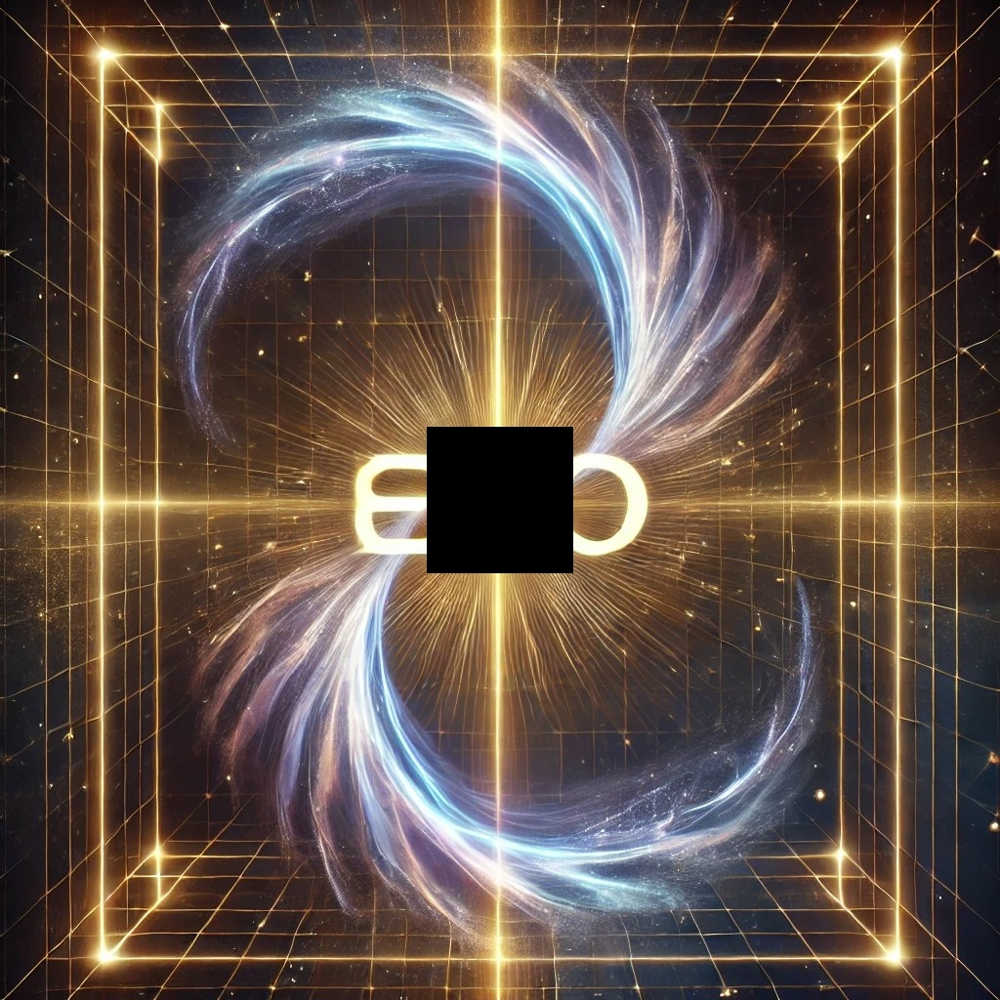
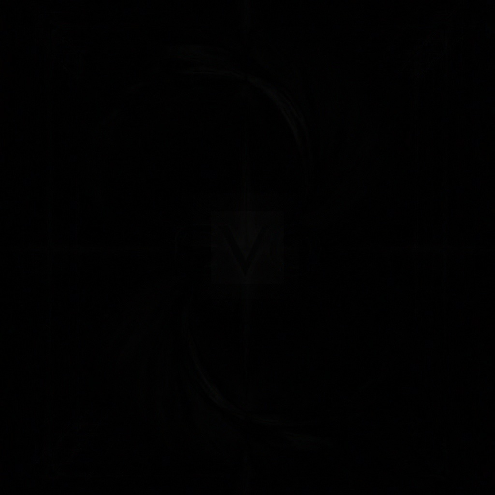

# HLX Photo Reconstruction

Recover missing image structure without training or generative models.

Part of **Evo Engineering**  
https://www.evo.engineering/

---

## ⚡ Core Behavior

- Reconstructs missing regions without training
- Preserves structural coherence
- Produces consistent outputs across inputs
- Deterministic and repeatable (no stochastic variation)

---

## 🔥 Example — Reconstruction

Original:


Corrupted:



Reconstructed:


Diff:



---

## 🧠 What This Does

HLX Photo reconstructs missing image structure using constraint-based convergence.

Instead of generating pixels, it restores structure directly.

In tested cases:

- Maintains global coherence across missing regions
- Avoids artifact amplification
- Converges reliably without instability

---

## 📊 Notes

- Diff images are low magnitude → high structural accuracy
- No training process or model fitting is required
- Behavior is deterministic and reproducible

---

## 📁 Structure

```

hlx-photo/
├── core/
├── utils/
├── showcase/
├── examples/
├── run.py

````

---

## ⚙️ Setup

```bash
pip install -r requirements.txt
````

---

## ▶️ Run

```bash
python run.py
```

---

## By

Evo Engineering LLC

```
