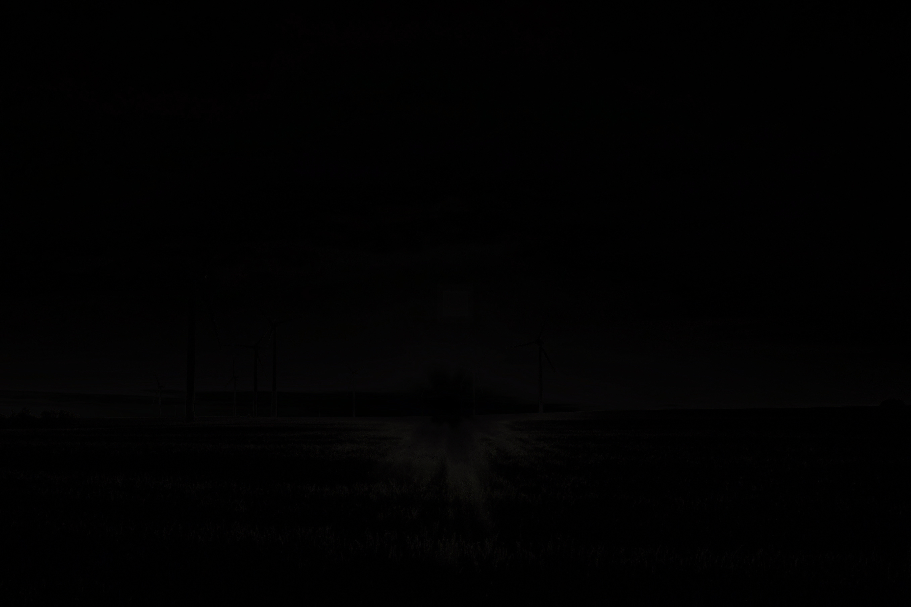
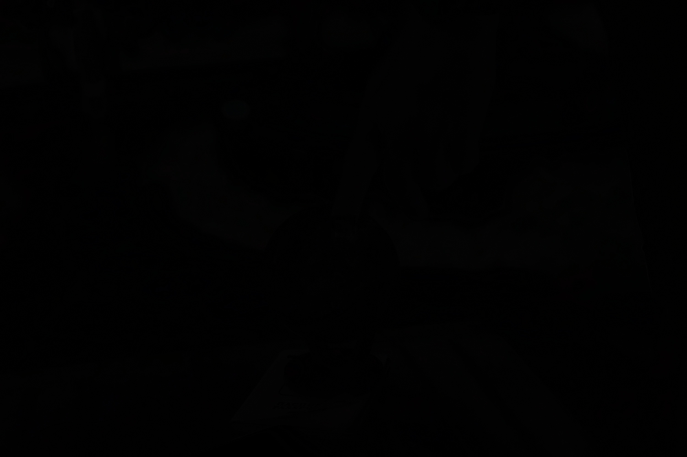
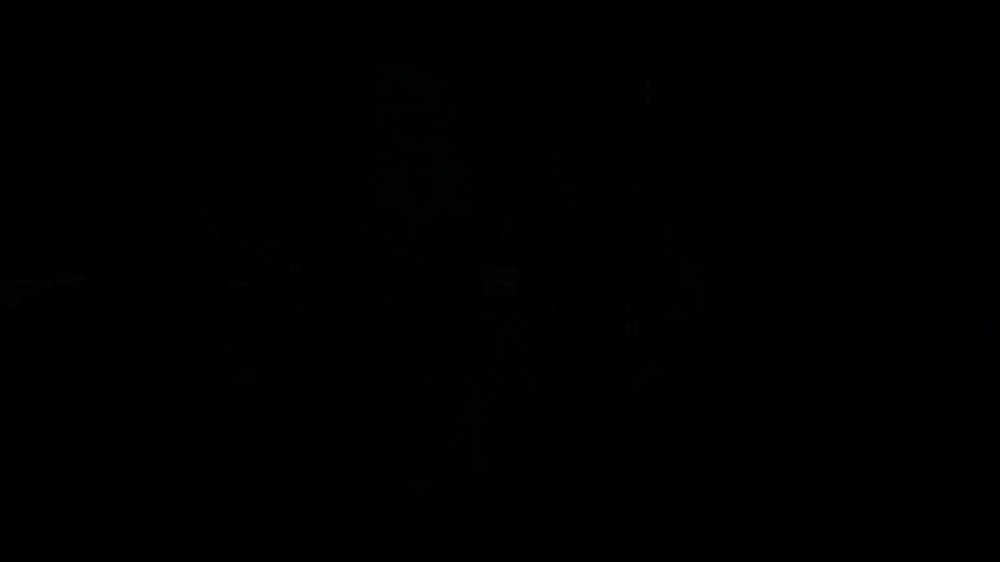
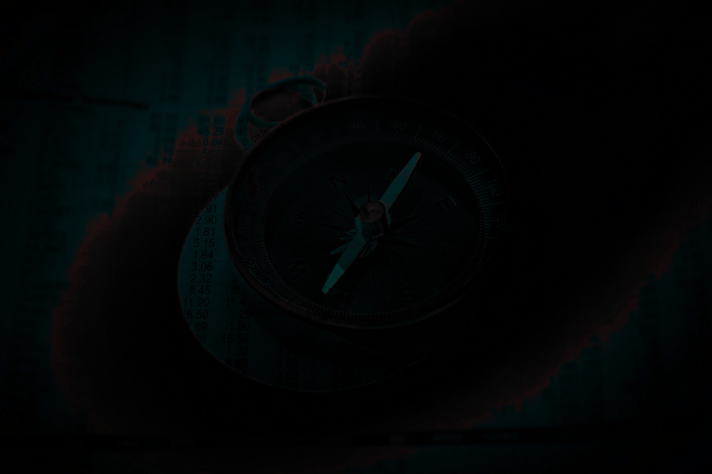

# HLX Photo Reconstruction

Deterministic image reconstruction using constraint-based convergence.

---

## What it does

* Reconstructs missing regions in images
* Preserves structural coherence
* Produces consistent results across inputs
* No training, no models, no randomness

---

## Example Results

### Example 1

**Original**


**Corrupted**


**Reconstructed**


**Diff (difference from original)**


---

### Example 2

**Original**


**Corrupted**


**Reconstructed**


**Diff**


---

### Example 3

**Original**


**Corrupted**


**Reconstructed**


**Diff**


---

### Example 4

**Original**


**Corrupted**


**Reconstructed**


**Diff**


---

### Example 5

**Original**


**Corrupted**


**Reconstructed**


**Diff**


---

## Notes

* Diff images are intentionally low magnitude — this indicates high reconstruction accuracy
* System is fully deterministic
* Reconstruction is achieved via iterative constraint enforcement, not generative prediction

---

## Run

```bash
python run.py
```

---

## Summary

This system reconstructs structure by iteratively eliminating inconsistent states until a stable solution remains.
